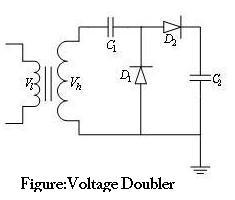

## Theory

The DC voltage produced by the half wave rectifier is less than the peak value of the Sine Wave. The size and ratings of the capacitors and transformers become very large if pure high voltage DC  is to be produced. Voltage Doublers are used  when higher DC voltages are needed. A typical voltagedoubler circuit due to Greinarcher is shown below:

The capacitor C1 is charged through rectifier D1 to a voltage +Vmax with polarity as shown in the figure during the negative half cycle. During the positive half cycle as the voltage of the transformer rises to Vhmax, the potential of the other terminal of C1 rises to 2Vhmax. The capacitor C2 is in turn charged through the Rectifier D2 to 2Vhmax.  Depending on the time constant C2RL where RL is the Load Resistance, the output voltage will be less than 2Vhmax. The rectifiers are rated to a Peak Inverse Voltage of 2Vhmax and it is preferable that both C1 & C2 have the same rating to affect equal amount of charge transfer. The ripple content is straight away proportional to the load current.  

Ripple is Calculated using the formula <strong>I/2*f[(1/C2)+(2/C1)]